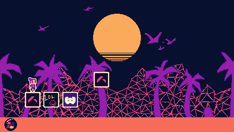
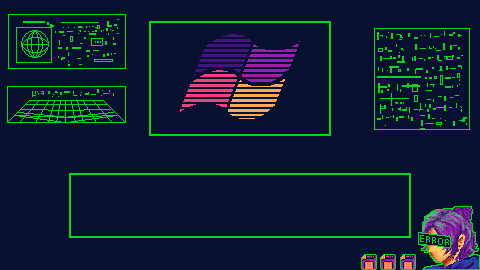
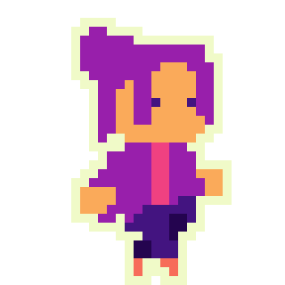
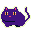

# Down Grade

<table>
<tr>
<td></td>
<td></td>
</tr>
</table>

> Um jogo feito em **48 horas** para game jam, tema **Vaporwave**.

---

## 🖥️ Sobre o jogo

Você acorda na área de trabalho de um **Windows antigo** (inspirado no queridinho da galera, Windows 7), mas algo está errado! A área de trabalho não é só um menu: é um espaço para ser explorado, navegando entre ícones que servem como plataformas e caminhos.

Logo no início você encontra um **pet misterioso**, que passa a te guiar por uma trilha "invisível" espalhada pelos ícones do computador.

Seguindo esse caminho, você chega ao **Bloco de Notas**. Ao interagir com ele, uma parte da *lore* do jogo é revelada. Mas assim que você fecha a janela, uma notificação aparece:

> **Atualização do Windows disponível.**

E aqui está a decisão central do jogo:

- **Atualizar** → **Game Over.** A atualização "sobrescreve" você.
- **Negar** → Você é puxado para uma **batalha**, onde precisa sobreviver para continuar avançando pela lore.

A cada hit de dano recebido, a "área de trabalho" vai se degradando um pouco mais. Essa ideia reflete o tema vaporwave de nostalgia digital, decadência tecnológica e a sensação de que o sistema (e talvez você) está sendo lentamente "sobrescrito" por algo mais novo.

## 🎞️ Sprites Animados
<table> <tr> <td align="center"><b>Personagem</b> </td> <td align="center"><b>Pet</b> </td> </tr> </table>

## 🎮 Como jogar

| Ação | Tecla |
|---|---|
| Mover | `A W S D` |
| Interagir | `E` |
| Pular | `SPACE` ou `W` |
| Batalha (esquiva) | Movimento do mouse |

## 🐾 Mecânicas principais

- **Exploração na área de trabalho**: navegação entre ícones como plataformas/pontos de interesse.
- **Pet-guia**: indica o caminho "invisível" através do desktop.
- **Bloco de Notas / Lore**: fragmentos de história desbloqueados progressivamente.
- **Escolha binária (Atualizar / Negar)**: decisão narrativa com consequência direta no gameplay.
- **Batalha**: você controla um mouse e precisa esquivar dos ataques movendo o cursor. Cada estágio conta com pelo menos 2 inimigos diferentes, cada um com um padrão de movimento próprio sincronizado com a música. Ao final de cada estágio, aparece uma roda de skill check, acertar o centro multiplica o score acumulado até aquele ponto.

## 🎨 Estética & Trilha sonora

- Visual pixel art com paleta vaporwave (referência: [Lospec](https://lospec.com/))
- Trilha sonora original composta em LMMS, com influências lo-fi/chase-music e a técnica clássica de "oitava mais baixa = efeito vaporwave"

## 🛠️ Tecnologias

- **Engine**: Godot 4 (C#)
- **Arte**: Aseprite
- **Música**: LMMS

## 👥 Créditos

Feito em 48h durante a **C.3 Winter Jam**, tema **Vaporwave**.

| Nome | Papel |
|---|---|
| Djullyene da Silva Cordeiro | Game Design, Roteiro, Sound Effects |
| Giulia Sousa Mendes | Arte, Código |
| Erik Fernando Pedrosa | Arte |
| João Vitor Ribeiro | Código |
| Arthur Pontes | Código |
| Rennan Januário | Código |

## ▶️ Como rodar

1. Baixe a build em `coming soon`
2. Extraia e execute o executável

## 🔗 Links

- Itch.io: `coming soon`

---

*Feito durante uma game jam de 48 horas.*
